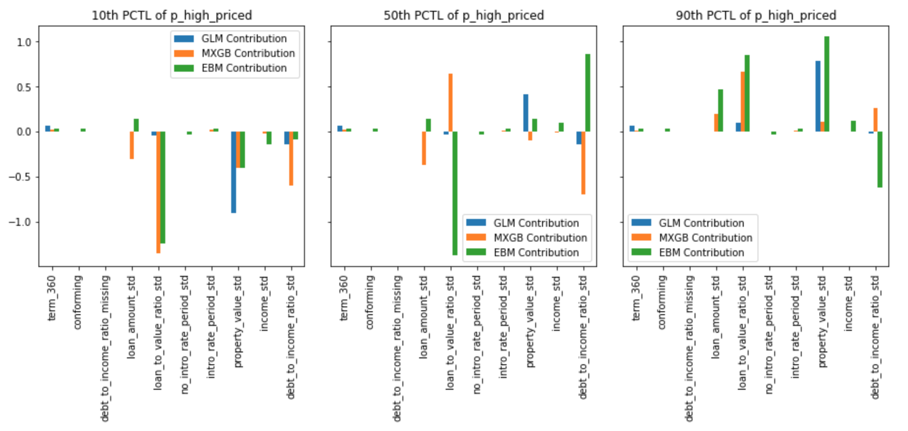
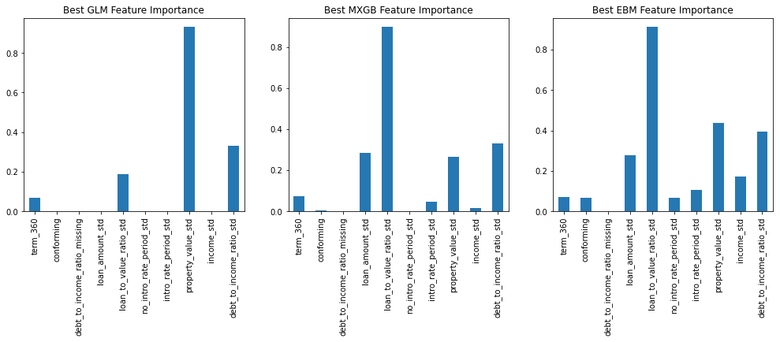

# GWU_Responsible_Machine_Learning
Group 3, the authors of this repository, spent seven weeks developing interpretable machine learning models during Summer 2022 in Professor Patrick Hall's Responsible Machine Learning course. The objective of our project is to predict the probability of applicants being charged a higher rate than others for mortgages using the Home Mortgage Disclosure Act's historic mortgage reporting data. To avoid the impetuous of deploying black-box machine learning models into social populaces that can be adversely affected by bias, our group strived to develop explainable and interpretable predictive models that improve trust and encourage ethical decisions. 

## Authors

* **Person or organization developing model**:
  * Kyle Lyon, `kylelyon@gwu.edu`
  * Charles Bloomer, `insert email`
  * Zeeshan Raza, `zraza10@gwu.edu`
  * Ziyad Maknojia, `zam@gwu.edu`
  
## Model Details

### Basic Information
* **Model date**: May, 2022
* **Model version**: 1.0
* **License**: Apache
* **Model implementation code**: TBD

### Intended Use
* **Primary intended uses**: add text
* **Primary intended users**: add text
* **Out-of-scope use cases**: add text

### Training Data

* **Data dictionary**:

| Name | Modeling Role | Measurement Level| Description|
| ---- | ------------- | ---------------- | ---------- |

* **Source of training data**: add text
* **How training data was divided into training and validation data**: add num
* **Number of rows in training and validation data**: 
  * Training rows: add num
  * Validation rows: add num

### Evaluation Data

### Test Data
* **Source of test data**: add text
* **Number of rows in test data**: add num
* **State any differences in columns between training and test data**: add text

### Model Details
* **Columns used as inputs in the final model**: add text
* **Column(s) used as target(s) in the final model**: add text
* **Type of models**: 
  * add text 
* **Software used to implement the model**: add text
* **Version of the modeling software**: TBD
* **Hyperparameters or other settings of your model**: TBD

### Quantitative Analysis
  * #### Week 1:

  * #### Week 2:
      * Local Feature Importance Across Models
         * 
      * Global Feature Importance Across Models
         * 
      * Partial Dependence

  * #### Week 3
     * Grid Search Results Plot
        * 
     * Best AIR and AUC
        * 
     * Best Model Hyperparameters
        * 
     * Best Model Features
        * 

  * #### Week 4
     * Model Extraction Attack
        * 
     * Stolen Decision Tree Model
        * 
     * Variable Importance: H20 Distributed Randomo Forest
        * 

  * #### Week 5

  * #### Week 6

### Ethical Considerations
